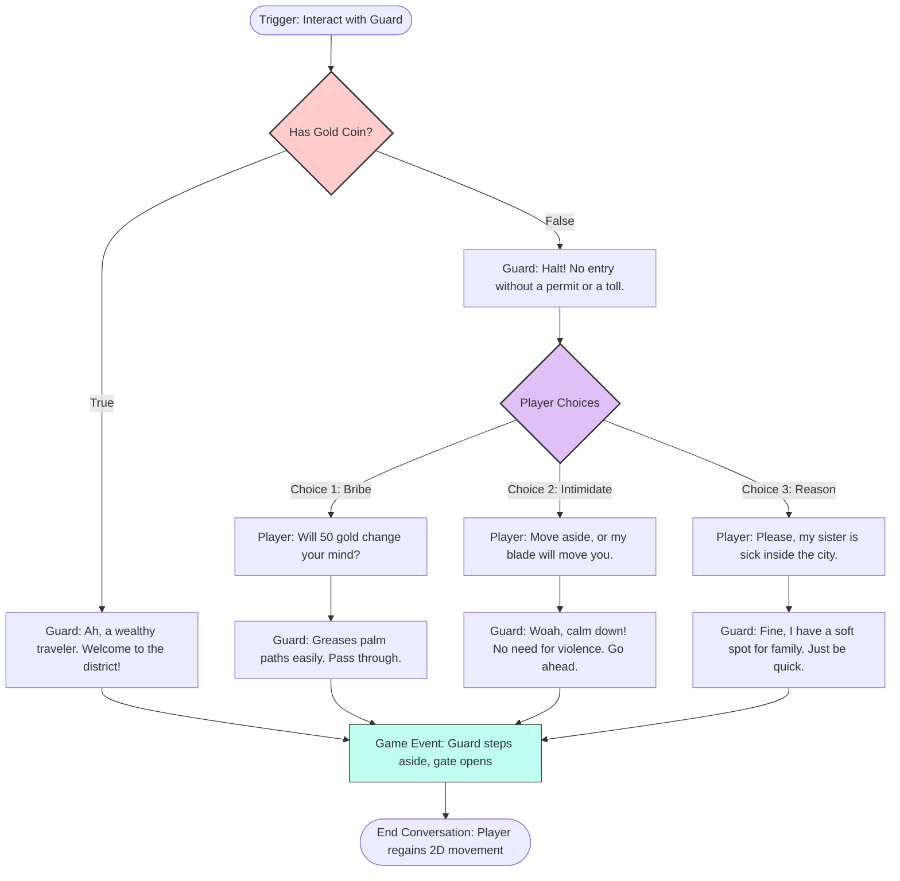

# Dream Butcher sample story layout

```mermaid
graph TD
    %% --- STATE / LOGIC CHECKS ---
    Start([Trigger: Interact with Guard]) --> CheckItem{Has Gold Coin?}

    %% --- CONDITIONAL BRANCHES ---
    CheckItem -->|True| LineGold[Guard: Ah, a wealthy traveler. Welcome to the district!]
    CheckItem -->|False| Line1[Guard: Halt! No entry without a permit or a toll.]

    %% --- MAIN DIALOGUE MULTIPLE CHOICE ---
    Line1 --> Choices{Player Choices}

    Choices -->|Choice 1: Bribe| C1[Player: Will 50 gold change your mind?]
    Choices -->|Choice 2: Intimidate| C2[Player: Move aside, or my blade will move you.]
    Choices -->|Choice 3: Reason| C3[Player: Please, my sister is sick inside the city.]

    %% --- OUTCOMES FROM CHOICES ---
    C1 --> GuardBribe[Guard: Greases palm paths easily. Pass through.]
    C2 --> GuardIntim[Guard: Woah, calm down! No need for violence. Go ahead.]
    C3 --> GuardReason[Guard: Fine, I have a soft spot for family. Just be quick.]

    %% --- CONVERGING TO LINEAR OUTCOME ---
    LineGold --> MoveEvent[Game Event: Guard steps aside, gate opens]
    GuardBribe --> MoveEvent
    GuardIntim --> MoveEvent
    GuardReason --> MoveEvent

    MoveEvent --> End([End Conversation: Player regains 2D movement])

    %% --- STYLING (For visual scannability in MD) ---
    classDef logic fill:#ffcccb,stroke:#333,stroke-width:2px;
    classDef choice fill:#e1bff7,stroke:#333,stroke-width:2px;
    classDef event fill:#bffff1,stroke:#333,stroke-width:1px;

    class CheckItem logic;
    class Choices choice;
    class MoveEvent event;
```
